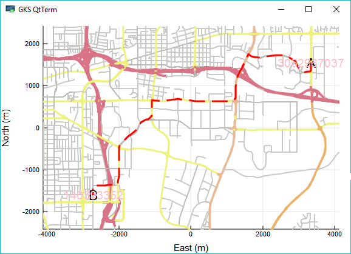
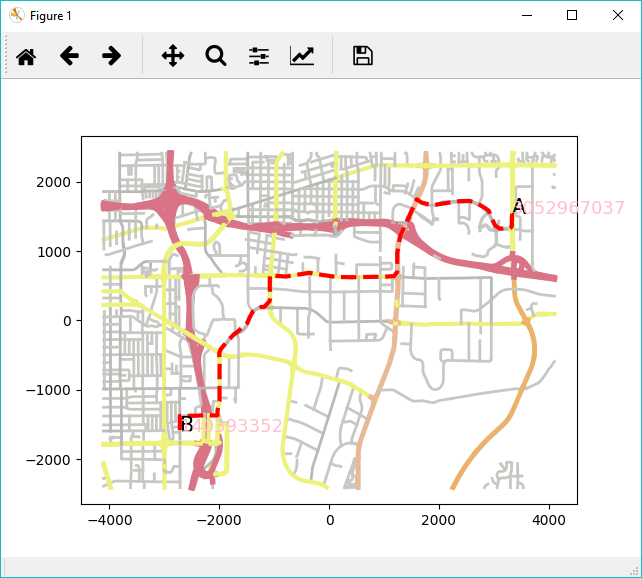

# OpenStreetMapXPlot.jl

Build status for Linux and macOS: [](https://travis-ci.org/pszufe/OpenStreetMapXPlot.jl) Test coverage: [](https://coveralls.io/github/pszufe/OpenStreetMapXPlot.jl?branch=master)   [Documentation ](https://pszufe.github.io/OpenStreetMapXPlot.jl/latest)

This is a plotting companion for the [OpenStreetMapX.jl](https://github.com/pszufe/OpenStreetMapX.jl) package. 

The package provides to plotting mechanisms for map vizualization:

- `Plots.jl` with GR as a back-end
- plotting directly to `PyPlot.jl` (please note that due to slower painting speed this option is reasonable only for small maps up to few thousand nodes)

## Installation

The current version has been tested with Julia 1.0.3

```julia
using Pkg
Pkg.add(PackageSpec(url="https://github.com/pszufe/OpenStreetMapX.jl"))
Pkg.add(PackageSpec(url="https://github.com/pszufe/OpenStreetMapXPlot.jl"))
```

## Usage

We will show a full scenario including routing. Let us start by preparing the data and calculating a sample route. 

```julia
using OpenStreetMapX
m = OpenStreetMapX.get_map_data("test/data/reno_east3.osm");
import Random
Random.seed!(0);
pointA = point_to_nodes(generate_point_in_bounds(m), m)
pointB = point_to_nodes(generate_point_in_bounds(m), m)
sr = OpenStreetMapX.shortest_route(m, pointA, pointB)[1]
```

Once the map data is in the memory we can start plotting. Let us start with `Plots.jl` with a `GR` back-end (this is the recommended approach due to GR's plotting speed, however due to Julia compiling process *time-to-the-first-plot* is around one minute, while subsequent plots can be created within few seconds). 

```julia
using OpenStreetMapXPlot
import Plots
Plots.gr()
p = OpenStreetMapXPlot.plotmap(m,width=600,height=400);
addroute!(p,m,sr;route_color="red");
plot_nodes!(p,m,[sr[1],sr[end]],start_numbering_from=nothing,fontsize=13,color="pink");
p
```




Now, let us paint the same route using the plain `PyPlot.jl` back-end. 

```julia
using OpenStreetMapXPlot
import PyPlot
p=OpenStreetMapXPlot.plotmap(m,width=600,height=400,use_plain_pyplot=true);
addroute!(p,m,sr;route_color="red");
plot_nodes!(p,m,[sr[1],sr[end]],start_numbering_from=nothing,fontsize=13,color="pink");
```



Note that when using `PyPlot.jl` in Atom, depending on your configuration you might need to add `PyPlot.display_figs()` to actually see the figure


**Any pull requests are welcome!**


#### Acknowledgments
<sup>This code is a major re-write of plotting functionality of [https://github.com/tedsteiner/OpenStreetMap.jl](https://github.com/tedsteiner/OpenStreetMap.jl) project.
The creation of this source code was partially financed by research project supported by the Ontario Centres of Excellence ("OCE") under Voucher for Innovation and Productivity (VIP) program, OCE Project Number: 30293, project name: "Agent-based simulation modelling of out-of-home advertising viewing opportunity conducted in cooperation with Environics Analytics of Toronto, Canada. </sup>
