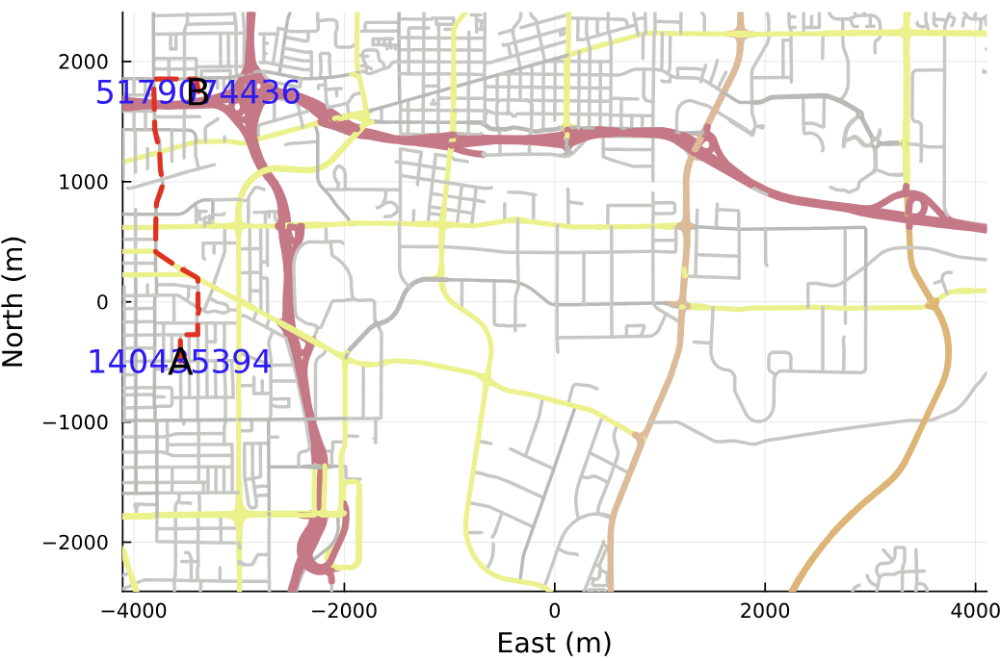

# OpenStreetMapXPlot.jl
This is a complete re-write of OpenStreetMap.jl package - plotting module.  

Compared to the original package this module uses `Plots.jl` with GR is used as backend for map vizualization. 

## Installation

The current version uses Julia 1.0.0

```julia
using Pkg
Pkg.add(PackageSpec(url="https://github.com/pszufe/OpenStreetMapX.jl"))
Pkg.add(PackageSpec(url="https://github.com/pszufe/OpenStreetMapXPlot.jl"))
```

Note that currently `Plots.jl` cannot be precompiled and hence the second command will show several warnings. 

## Usage

```julia
using OpenStreetMapX, OpenStreetMapXPlot
map_data = OpenStreetMapX.get_map_data("/home/ubuntu/", "mymap.osm");

p = OpenStreetMapXPlot.plotmap(map_data.nodes, OpenStreetMapX.ENU(map_data.bounds), roadways=map_data.roadways,roadwayStyle = OpenStreetMapXPlot.LAYER_STANDARD, width=600, height=600)
```



See the `samples` directory for a more complete example with routing and drawing routes.  

**Any pull requests are welcome!**


#### Acknowledgments
<sup>This code is a major re-write of plotting functionality of [https://github.com/tedsteiner/OpenStreetMap.jl](https://github.com/tedsteiner/OpenStreetMap.jl) project.
The creation of this source code was partially financed by research project supported by the Ontario Centres of Excellence ("OCE") under Voucher for Innovation and Productivity (VIP) program, OCE Project Number: 30293, project name: "Agent-based simulation modelling of out-of-home advertising viewing opportunity conducted in cooperation with Environics Analytics of Toronto, Canada. </sup>
